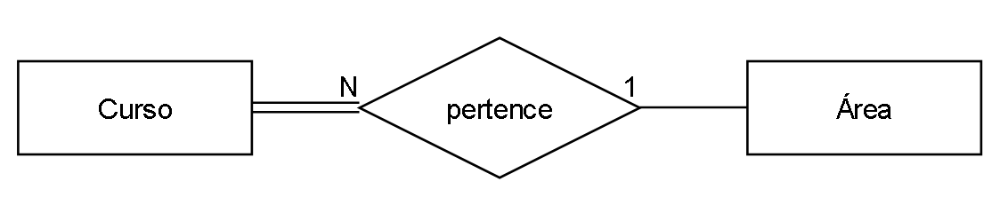
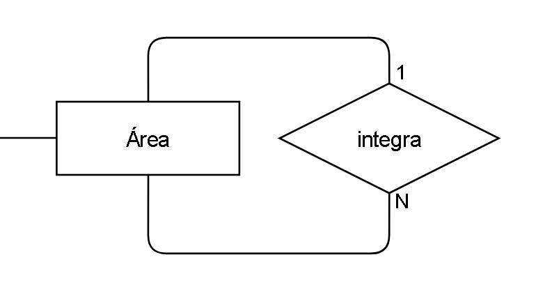
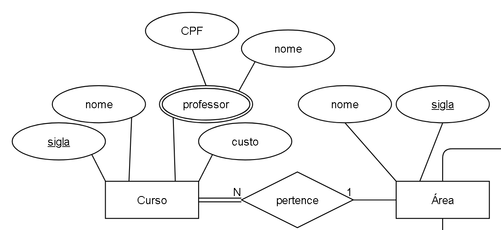
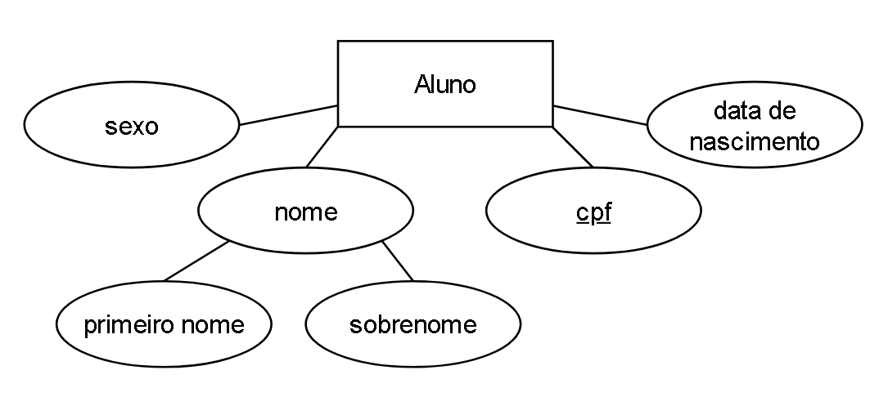
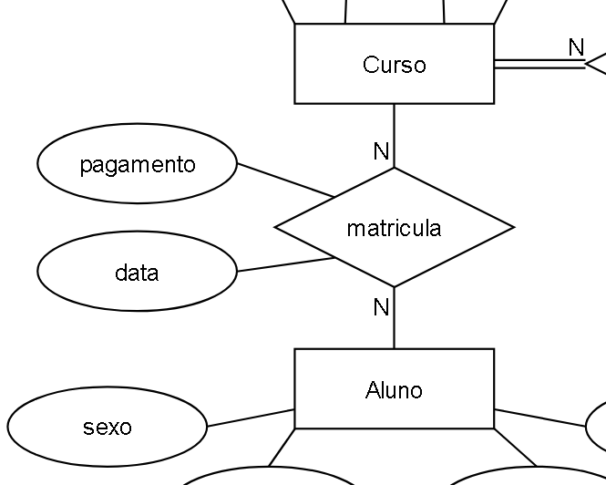
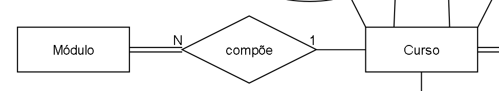
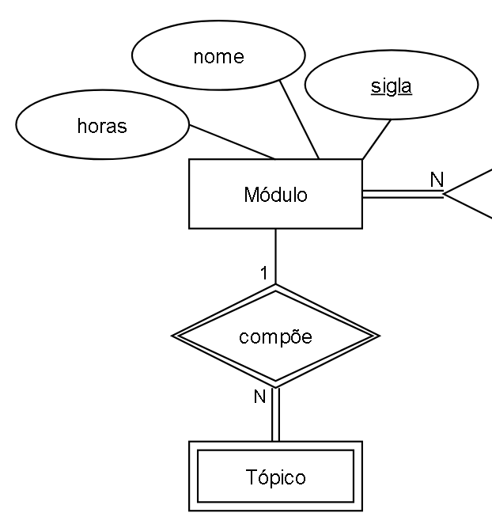
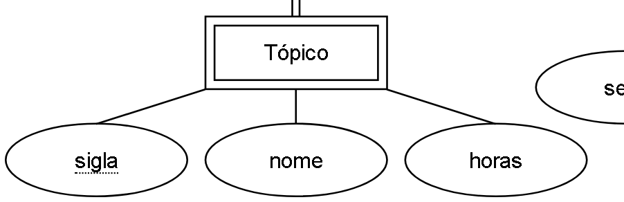
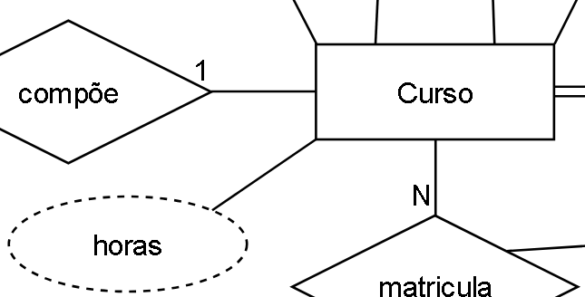
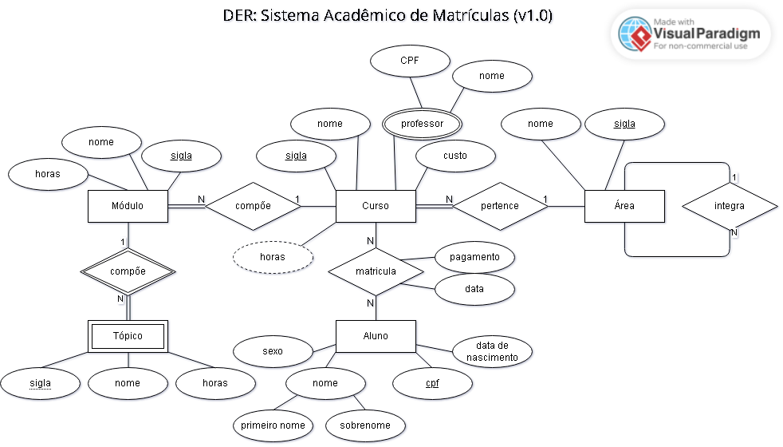

# HO02: Modelagem Conceitual

## Conceitos Básicos

A modelagem conceitual refere-se à abstração de uma descrissão textual (minimundo) de requisitos e dados, para uma forma de representação gráfica das entidades, atributos e relacionamentos. Este conceito faz parte da etapa de projeto conceitual do BD, e comumente é adotado o **Diagrama de Entidade-Relacionamento (DER)** usando a notação de **Peter Chen**.

## Principais Elementos

De forma geral, os elementos do DER se resumem em uma representação para as entidades, os atributos e os relacionamentos, variando conforme a especificidade de cada um, conforme contexto no minimundo. Além disso, cada elemento possui uma forma de representação e um rótulo, que precisam manter-se no mesmo padrão de escrita do início ao fim do diagrama.

Seguem principais representações:

### >> Entidade Forte

### >> Entidade Fraca

### >> Relacionamento

### >> Relacionamento Fraco

### >> Atributo

### >> Atributo Chave

### >> Atributo Chave Parcial

### >> Atributo Multivalorado

### >> Atributo Derivado

### >> Atributo Composto

### >> Participação Parcial de E1 em R

### >> Participação Total de E1 em R

### >> Cardinalidade 1:N de E1 para E2

### >> Limites de Cardinalidade de E1 em R

## Convenção de Nomes

Elementos do modelo ER podem ser aferidos por estruturas textuais, facilitanto a interpretação textual de um minimundo para um DER.

${\color{green}\text{ENTIDADES}}$ - podem ser identificadas por substantivos, geralmente nomes no singular com letra inicial em maiúsculo.

${\color{red}\text{RELACIONAMENTO}}$ - podem ser identificados por verbos.

${\color{blue}\text{ATRIBUTOS}}$ - podem ser identificados por nomes com letras iniciais em maiúsculo ou não, e abtributos multivalorados estarão no plural.

Obs.: As especificidades de cada elemento a ser retratado no diagrama, como atributo chave, cardinalidade, dentre outros, estarão explicitados no texto com uma combinação de palavras que indique tal especificidade.

## Atividade do Hands-On

Gerar um modelo conceitual representado como um diagrama entidade-relacionamento (DER) usando a notação de Peter Chen. A partir da seguinte descrição de minimundo:
<blockquote>
Esta é a descrição textual de minimundo do SAM (v1.0). O SAM (Sistema Acadêmico de Matrículas) gerencia a matrícula de alunos em cursos em instituições de ensino. Em particular, os cursos da instituição de ensino são categorizados por áreas de conhecimento, sendo que um curso obrigatoriamente pertence a uma área e uma área pode possuir vários cursos. Além disso, uma área pode ser integrada por outras áreas, sendo que uma área só pode ser integrante de uma única área. As áreas são identificadas por sua sigla e possuem um nome. Os cursos são identificados por sua sigla e possuem nome, custo e professores, compostos por CPF e nome. Alunos são identificados pelo seu CPF e possuem nome, composto de primeiro nome e sobrenome, sexo e data de nascimento. Cada aluno pode se matricular em diversos cursos, sendo que em cada curso podemos ter diversos alunos matriculados, mas devemos conhecer a data e se o aluno pagou ou não a matrícula no curso. Cada curso é composto por módulos, sendo que um módulo compõe apenas um curso e não existem módulos sem vínculo a algum curso. Cada módulo é identificado por sua sigla e possui um nome. Cada módulo é composto por tópicos, sendo que cada tópico só existe em função de um módulo. Um tópico potencialmente pode ser identificado por sua sigla e possui nome e horas (carga horária do tópico). As horas do curso são derivadas da totalização das horas dos tópicos que compõem os módulos dos cursos.
</blockquote>

### Estratégia

Após uma leitura inicial de contextualização, o objetivo é dividir o problema em frases e interpretar uma a uma, destacando os termos que ajudam a identificar a forma como o diagrama deverá ser construído.

### Frase 01

> Esta é a descrição textual de minimundo do SAM (v1.0). O SAM (Sistema Acadêmico de Matrículas) gerencia a matrícula de alunos em cursos em instituições de ensino.

Contexto da  descrissão de minimundo - titulação.

### Frase 02

> Em particular, os ${\color{green}\text{cursos}}$ da instituição de ensino são <u>categorizados</u> por ${\color{green}\text{área}}$ de conhecimento, sendo que <u>um</u> ${\color{green}\text{curso}}$ <u>obrigatoriamente</u> ${\color{red}\text{pertence}}$ a uma ${\color{green}\text{área}}$ e uma ${\color{green}\text{área}}$ <u>pode</u> ${\color{red}\text{possuir}}$ vários ${\color{green}\text{cursos}}$.

### Frase 03

> Além disso, uma ${\color{green}\text{área}}$ <u>pode</u> ser ${\color{red}\text{integrada}}$ por outras ${\color{green}\text{áreas}}$, sendo que uma ${\color{green}\text{área}}$ só pode ser ${\color{red}\text{integrante}}$ de uma <u>única</u> ${\color{green}\text{área}}$. 

### Frase 04

> As ${\color{green}\text{áreas}}$ são <u>identificadas</u> por sua ${\color{blue}\text{sigla}}$ e <u>possuem</u> um ${\color{blue}\text{nome}}$. Os ${\color{green}\text{cursos}}$ são <u>identificados</u> por sua ${\color{blue}\text{sigla}}$ e <u>possuem</u> ${\color{blue}\text{nome}}$, ${\color{blue}\text{custo}}$ e ${\color{blue}\text{professores}}$, <u>compostos</u> por ${\color{blue}\text{CPF}}$ e ${\color{blue}\text{nome}}$.

### Frase 05

> ${\color{green}\text{Alunos}}$ são <u>identificados</u> pelo seu ${\color{blue}\text{CPF}}$ e <u>possuem</u> ${\color{blue}\text{nome}}$, <u>composto</u> de ${\color{blue}\text{primeiro nome}}$ e ${\color{blue}\text{sobrenome}}$, ${\color{blue}\text{sexo}}$ e ${\color{blue}\text{data de nascimento}}$.

### Frase 06

> Cada ${\color{green}\text{aluno}}$ <u>pode</u> se ${\color{red}\text{matricular}}$ em <u>diversos</u> ${\color{green}\text{cursos}}$, sendo que <u>em cada</u> ${\color{green}\text{curso}}$ podemos ter <u>diversos</u> ${\color{green}\text{alunos}}$ ${\color{red}\text{matriculados}}$, **mas devemos conhecer** a ${\color{blue}\text{data}}$ e se o ${\color{green}\text{aluno}}$ ${\color{blue}\text{pagou}}$ ou não a ${\color{red}\text{matricula}}$ no ${\color{green}\text{curso}}$. 

### Frase 07

> Cada ${\color{green}\text{curso}}$ é ${\color{red}\text{composto}}$ por ${\color{green}\text{módulos}}$, sendo que <u>um</u> ${\color{green}\text{módulo}}$ ${\color{red}\text{compõe}}$ <u>apenas um</u> ${\color{green}\text{curso}}$ e **não existem** ${\color{green}\text{módulos}}$ <u>**sem vínculo**</u> a algum ${\color{green}\text{curso}}$. 

### Frase 08

> Cada ${\color{green}\text{módulo}}$ é <u>identificado</u> por sua ${\color{blue}\text{sigla}}$ e <u>possui</u> um ${\color{blue}\text{nome}}$. Cada ${\color{green}\text{módulo}}$ é ${\color{red}\text{composto}}$ por ${\color{green}\text{tópicos}}$, sendo que cada **tópico só existe em função de** um ${\color{green}\text{módulo}}$. 

### Frase 09

> Um ${\color{green}\text{tópico}}$ <u>potencialmente pode</u> ser <u>identificado</u> por sua ${\color{blue}\text{sigla}}$ e <u>possui</u> ${\color{blue}\text{nome}}$ e ${\color{blue}\text{horas}}$ (carga horária do tópico). 

### Frase 10

> As ${\color{blue}\text{horas}}$ do ${\color{green}\text{curso}}$ são <u>derivadas</u> da totalização das ${\color{blue}\text{horas}}$ dos ${\color{green}\text{tópico}}$ que compõem os ${\color{green}\text{módulo}}$ dos ${\color{green}\text{cursos}}$.

## DER Final

