# HO02: Modelagem Conceitual

## Conceitos Básicos

A modelagem conceitual refere-se à abstração de uma descrissão textual (minimundo) de requisitos e dados, para uma forma de representação gráfica das entidades, atributos e relacionamentos. Este conceito faz parte da etapa de projeto conceitual do BD, e comumente é adotado o **Diagrama de Entidade-Relacionamento (DER)** usando a notação de **Peter Chen**.

## Principais Elementos

De forma geral, os elementos do DER se resumem em uma representação para as entidades, os atributos e os relacionamentos, variando conforme a especificidade de cada um, conforme contexto no minimundo. Além disso, cada elemento possui uma forma de representação e um rótulo, que precisam manter-se no mesmo padrão de escrita do início ao fim do diagrama.

Seguem principais representações:

### >> Entidade Forte

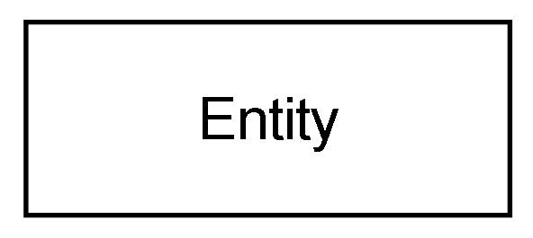

### >> Entidade Fraca

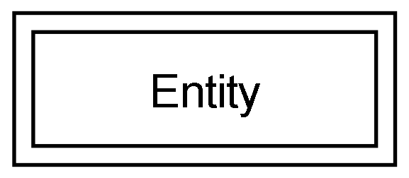

### >> Relacionamento

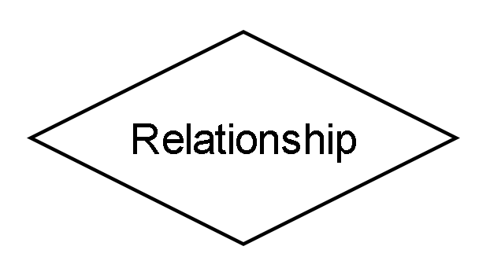

### >> Relacionamento Fraco

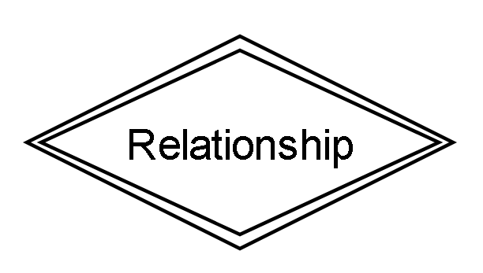

### >> Atributo

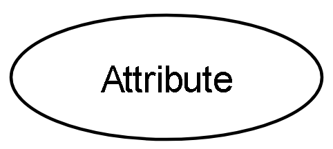

### >> Atributo Chave

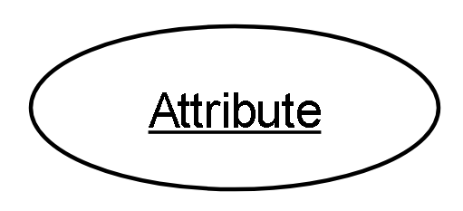

### >> Atributo Chave Parcial

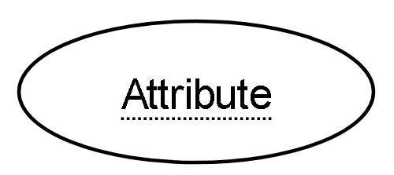

### >> Atributo Multivalorado

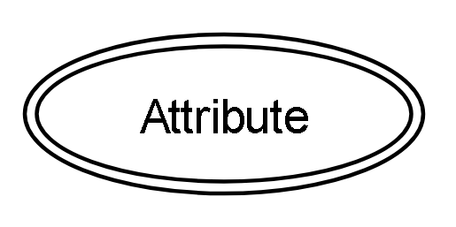

### >> Atributo Derivado

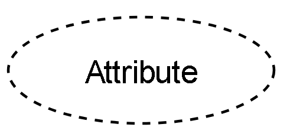

### >> Atributo Composto

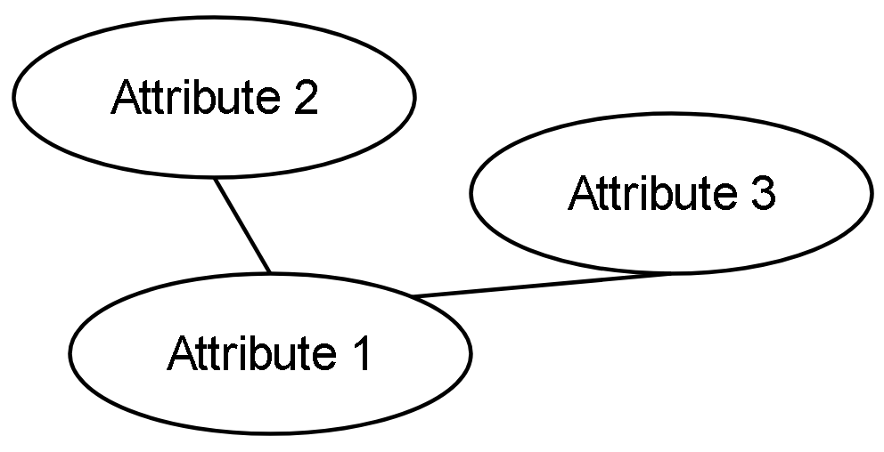

### >> Participação Parcial de E1 em R

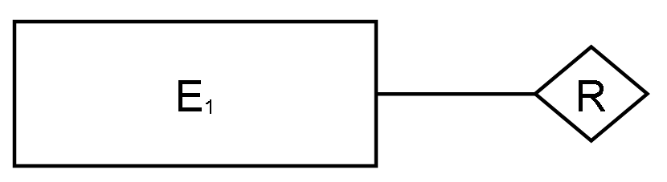

### >> Participação Total de E1 em R

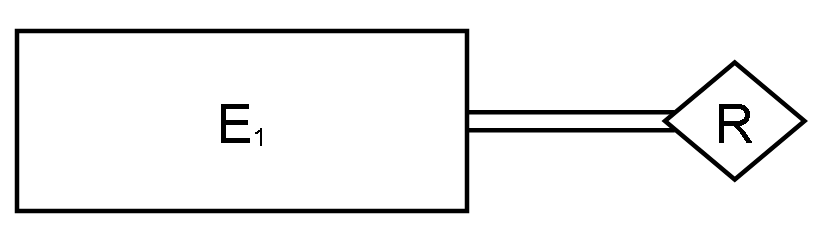

### >> Cardinalidade 1:N de E1 para E2

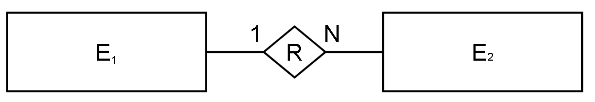

### >> Limites de Cardinalidade de E1 em R

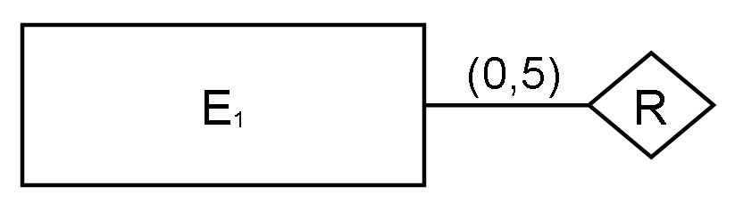

