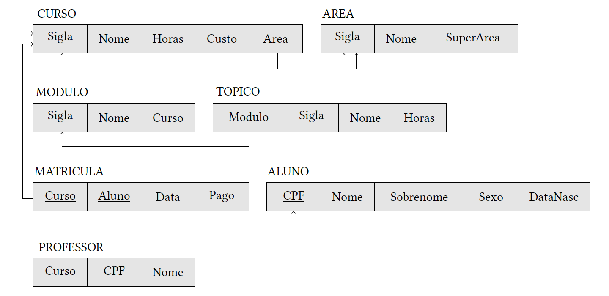

# HO06: SQL (DDL)

## Atividade do Hands-On

Construir um diagrama de implementação do banco de dados SAM a partir do modelo relacional abaixo e especificar consultas em SQL para criar o esquema, as tabelas e restrições (domínio, nulidade, unicidade, valor, valor padrão, chave e integridade referencial) do banco de dados SAM.

